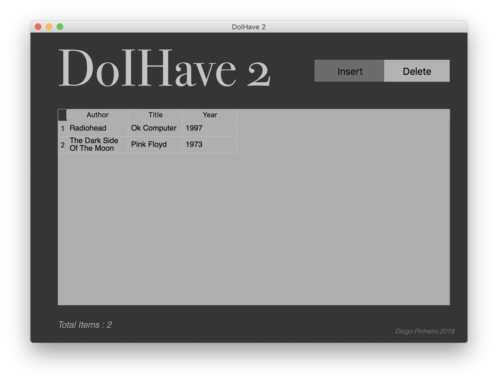
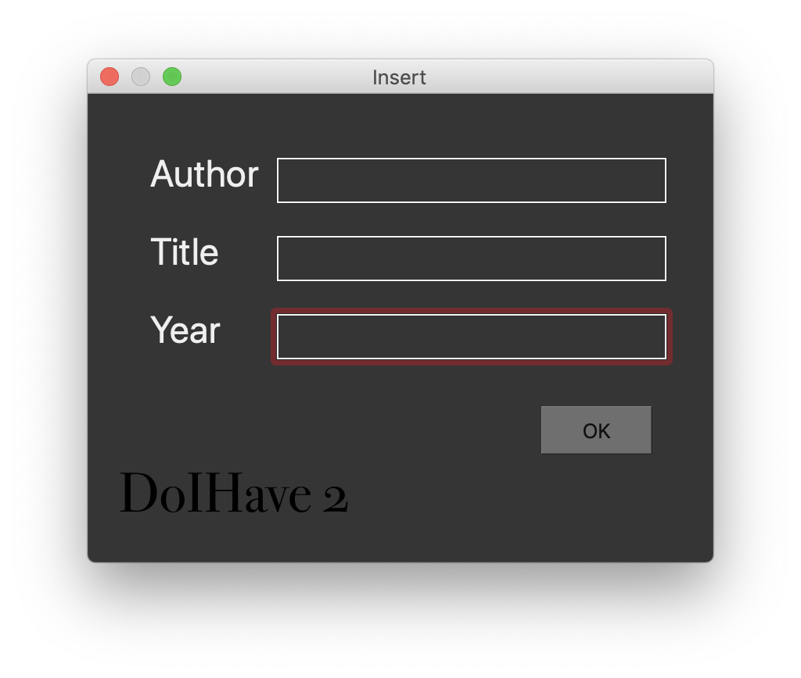

# DoIHave2
DoIHave2 is a simplified version of the DoIHave database management application. This one only allows the user to insert and delete
items from the database.

Made with:
  - Python 3
  - PyQt
  - Sqlite 3

Work in progress
